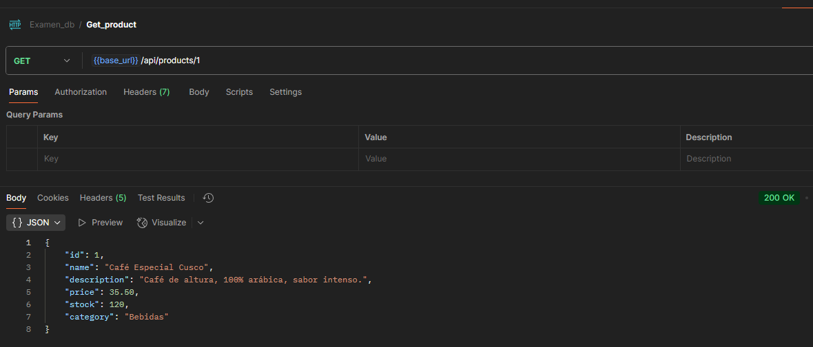
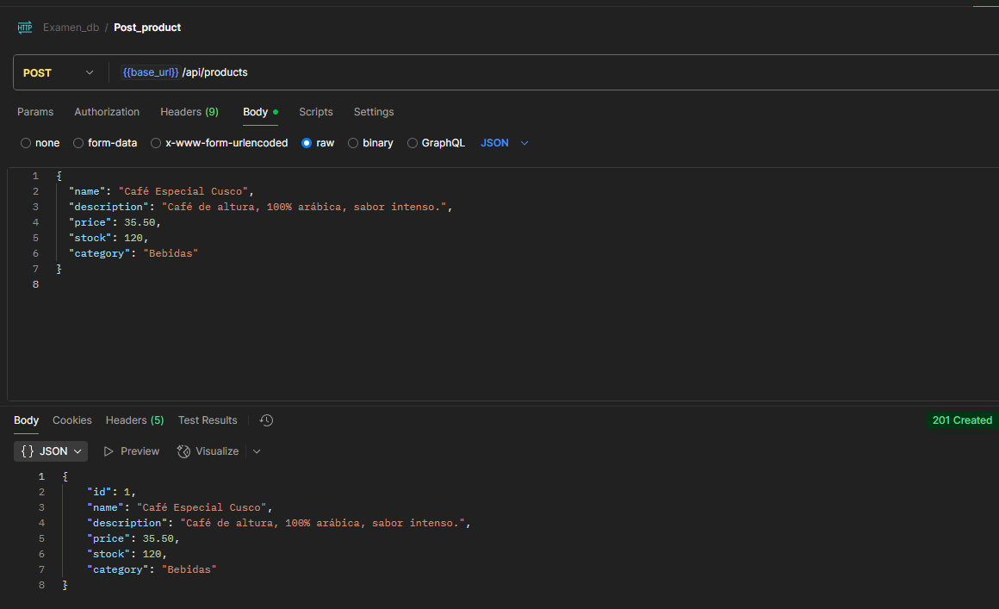

El proyecto se corre a través de este comando:
"./mvnw spring-boot:run”

Se implemento el patrón de arquitectura en capas, una de las estructuras más comunes y recomendadas en aplicaciones empresariales y microservicios con Spring Boot.

1. controller/

ProductController.java
Controla todas las solicitudes HTTP relacionadas a productos. Expone los endpoints REST para crear, leer, actualizar y eliminar productos. Se comunica directamente con la capa de servicios.

2. service/

ProductService.java
Es una interfaz que define los métodos de negocio relacionados a productos.

ProductServiceImpl.java
Implementa la interfaz ProductService. Aquí está la lógica de negocio, validaciones y procesamiento antes de acceder al repositorio.

MsProductsApplication.java
Clase principal para arrancar el microservicio Spring Boot.

3. repository/

ProductRepository.java
Interfaz que extiende JpaRepository. Define operaciones CRUD y consultas a la base de datos para la entidad Product. Es la “puerta” de acceso a los datos.

4. model/

Product.java
Clase entidad que representa la tabla product en la base de datos. Define los atributos del producto, sus validaciones y las anotaciones de JPA.

5. exception/

ErrorDetails.java
Estructura estándar para devolver detalles de errores en las respuestas HTTP.

GlobalExceptionHandler.java
Clase que captura y maneja excepciones de manera global en la aplicación, devolviendo mensajes claros y estructurados al usuario.

InvalidProductException.java
Excepción personalizada para indicar errores de validación en los datos de un producto.

ProductNotFoundException.java
Excepción personalizada para manejar el caso donde un producto no existe en la base de datos.

ResourceNotFoundException.java
Excepción genérica para recursos no encontrados.
